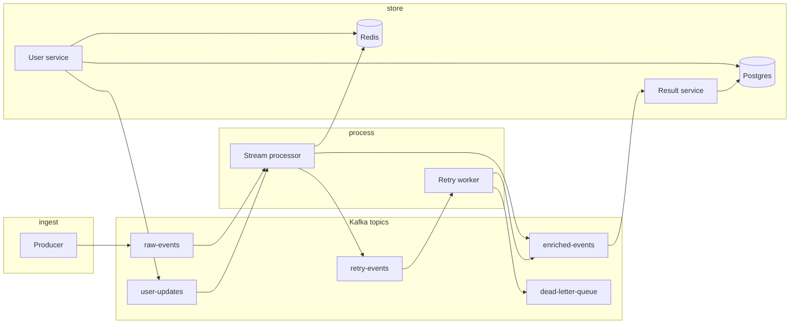

# Kafka Event Enrichment Pipeline

A **production-style reference** for an event enrichment pipeline: **Apache Kafka** (KRaft single broker), **Redis** for projection + idempotency, **PostgreSQL** for users and stored enriched outcomes, **Confluent Schema Registry** with **Avro** payloads, optional **Kafka transactions (EOS)** (produce + offset commit), **consumer lag** metrics, **OpenTelemetry** to **Jaeger**, **circuit breaker** on User Service HTTP, **non-blocking retry** (`retry_after`), **DLQ** persistence + **replay** API, and **observability dashboards**.

**What you get in this repo**

| Area | Contents |
|------|----------|
| **Services** | Mock **producer** (raw events + admin API), **stream processor** (consumer), **user service** (Postgres + Redis + `user-updates`), **retry worker**, **DLQ handler**, **result service** (reads committed enriched output → Postgres) |
| **APIs** | **Producer admin** (`/admin/speed`, `/admin/duplicates`) on port **8010**; **dashboard-api** aggregates Prometheus scrapes, proxies producer controls and demo scenarios, activity log |
| **UIs** | **React** app in `dashboard_ui/` (served on **8501** in Compose, nginx proxies `/api` → dashboard-api). Optional **Streamlit** app in `dashboard/` for local experimentation |
| **Infra** | `infra/docker-compose.yml` — one-command stack with named volumes for Kafka, Postgres, DLQ JSONL |
| **Scripts** | `scripts/demo.sh` (curl demo), `scripts/load_sim.py` (host → Kafka **9094**), `scripts/reset-kafka-fresh.sh` (empty pipeline topics without wiping DB) |

---

## Architecture (data flow)



1. **Producer** → `raw-events` (W3C trace context in headers when OTLP is configured).
2. **User service** → Postgres + publishes snapshots to `user-updates`.
3. **Stream processor** → consumes `raw-events` + `user-updates` → Redis → `enriched-events` or `retry-events` (transactional EOS optional).
4. **Retry worker** → `retry-events` → honors `retry_after` → republish / `enriched-events` / DLQ.
5. **Result service** → consumes `enriched-events` with **`isolation_level=read_committed`** → Postgres `enriched_results`.
6. **DLQ handler** → persists DLQ JSONL, **`POST /replay`** can push back toward the pipeline.

**Horizontal scaling:** use a **unique** `KAFKA_TRANSACTIONAL_ID` (e.g. hostname) per `stream-processor` replica. In Compose, `docker compose ... up --scale stream-processor=2` requires removing conflicting **host** port mappings for that service.

---

## Infrastructure (Docker Compose)

**File:** `infra/docker-compose.yml` (always reference it from the **repository root** unless you `cd infra` and adjust paths).

| Service | Image / build | Host port | Role |
|---------|----------------|-----------|------|
| **kafka** | apache/kafka:3.8.0 | **9092** (internal), **9094** (**EXTERNAL** for tools on the host) | Single-node KRaft broker; data in volume `kafka_data` |
| **kafka-init** | one-shot | — | Creates topics if missing: `raw-events`, `user-updates`, `enriched-events`, `retry-events`, `dead-letter-queue` (3 partitions, RF=1) |
| **schema-registry** | Confluent | **8081** | Avro schemas |
| **jaeger** | all-in-one | **16686** UI, **4317** OTLP gRPC | Traces |
| **postgres** | 16-alpine | **5434** → container 5432 | DB `pipeline`, user/password `pipeline` |
| **redis** | 7.2-alpine | **6379** | Cache + idempotency (AOF disabled in Compose) |
| **user-service** | build | **8080** | Users + Kafka + Redis |
| **producer** | build | **8010** | Raw events + **producer admin** |
| **stream-processor** | build (`services/consumer`) | **8002** | Metrics + processing |
| **retry-worker** | build | **8004** | |
| **dlq-handler** | build | **8005** | DLQ file volume `dlq_data` |
| **result-service** | build | **8006** | |
| **dashboard-api** | build | **8090** | Scrapes service `/metrics`, `/api/*` |
| **dashboard-ui** | build | **8501** | Static React + nginx → proxies `/api` to dashboard-api |

**Volumes**

| Volume | Purpose |
|--------|---------|
| `kafka_data` | Broker log segments (topic backlog lives here) |
| `postgres_data` | Postgres cluster files |
| `dlq_data` | DLQ JSONL backing store |

**Listeners**

- From **other containers**: `kafka:9092` (PLAINTEXT).
- From **your laptop** (load sim, local scripts): `localhost:9094` (advertised **EXTERNAL** listener).

---

## Prerequisites

- **Docker Compose v2** (`docker compose`, not legacy `docker-compose`)
- Free **host ports** (typical): 4317, 5434, 6379, 8010, 8080, 8081, 8002, 8004, 8005, 8006, 8090, 8501, 9092, 9094, 16686

Define a short alias (optional, used below):

```bash
export COMPOSE="docker compose -f infra/docker-compose.yml"
```

Run all compose commands from the **repo root** (`volleyball/`).

---

## Starting the stack

**First start or after code changes (rebuild images):**

```bash
docker compose -f infra/docker-compose.yml up --build -d
```

**Foreground (logs in terminal):**

```bash
docker compose -f infra/docker-compose.yml up --build
```

**Open the UI:** [http://localhost:8501](http://localhost:8501)  
**Jaeger:** [http://localhost:16686](http://localhost:16686)  
**Producer admin (direct):** [http://localhost:8010/admin/speed](http://localhost:8010/admin/speed) (the React UI calls dashboard-api, which proxies here.)

---

## Restarting

**Restart every container (keeps volumes):**

```bash
docker compose -f infra/docker-compose.yml restart
```

**Restart one service** (example: stream processor after config change):

```bash
docker compose -f infra/docker-compose.yml restart stream-processor
```

**Recreate containers from images** (after `docker compose build`, no volume wipe):

```bash
docker compose -f infra/docker-compose.yml up -d --force-recreate
```

**Follow logs:**

```bash
docker compose -f infra/docker-compose.yml logs -f stream-processor producer dashboard-api
```

---

## Cleaning and “fresh start”

Choose how aggressive you want to be.

### 1) Clear Kafka topic backlogs (keep Postgres + Redis)

Empties pipeline topics and recreates them; **does not** delete Postgres data. Optional **`--redis`** clears Redis (`FLUSHALL`) so idempotency keys and cached projections are gone too.

```bash
chmod +x scripts/reset-kafka-fresh.sh
./scripts/reset-kafka-fresh.sh           # Kafka topics only
./scripts/reset-kafka-fresh.sh --redis  # topics + Redis flush
```

### 2) Stop stack, keep volumes

```bash
docker compose -f infra/docker-compose.yml stop
```

### 3) Remove containers and default network (volumes kept)

```bash
docker compose -f infra/docker-compose.yml down
```

### 4) Nuclear: delete Compose volumes (Kafka + Postgres + DLQ files)

**Destructive:** wipes DB, Kafka logs, DLQ store.

```bash
docker compose -f infra/docker-compose.yml down -v
```

Next `up --build` recreates empty volumes; **kafka-init** recreates topics; apps run migrations as on first boot.

### 5) Kafka volume only (advanced)

If you prefer not to use the script: `down`, remove only the `kafka_data` volume for your project name (see `docker volume ls`), then `up -d` again so topics are recreated.

---

## Local development (without rebuilding all images)

**React dashboard** (`dashboard_ui/`): Vite dev server proxies `/api` to dashboard-api on **8090** (see `vite.config.ts`).

```bash
# Terminal 1 — stack (or at least dashboard-api + dependencies)
docker compose -f infra/docker-compose.yml up -d

# Terminal 2 — UI hot reload
cd dashboard_ui && npm ci && npm run dev
```

**Build UI only (CI / sanity):**

```bash
cd dashboard_ui && npm ci && npm run build
```

**Streamlit** (optional, separate from Compose UI):

```bash
pip install -r requirements.txt
export STREAM=...  # see dashboard/app.py env usage
streamlit run dashboard/app.py
```

---

## Scripts and demos

| Script | Purpose |
|--------|---------|
| `scripts/reset-kafka-fresh.sh` | Stop Kafka clients → delete pipeline topics → `kafka-init` → `up -d` (see [Cleaning](#cleaning-and-fresh-start)) |
| `scripts/demo.sh` | Curl-based walkthrough (health, simulate-down, restore, sample metrics) |
| `scripts/load_sim.py` | Publish from host to **`localhost:9094`** |

**Demo (user service on localhost):**

```bash
chmod +x scripts/demo.sh
USER_SERVICE_URL=http://localhost:8080 ./scripts/demo.sh
```

**Load simulation (host → Kafka external listener):**

```bash
export PYTHONPATH=.
export KAFKA_BOOTSTRAP_SERVERS=localhost:9094
python scripts/load_sim.py
```

---

## Tests

**Python** (from repo root; needs `pytest` + deps on `PYTHONPATH`):

```bash
pip install -r requirements.txt pytest
PYTHONPATH=. pytest tests/
```

**Dashboard UI:**

```bash
cd dashboard_ui && npm ci && npm test
```

---

## Environment highlights

| Variable | Purpose |
|----------|---------|
| `KAFKA_ENABLE_TXN` | `1` = transactional producer + `send_offsets_to_transaction` (default in Compose for processor / retry worker) |
| `KAFKA_TRANSACTIONAL_ID` | Unique per process; default `stream-processor-txn-{hostname}` |
| `KAFKA_USE_AVRO` | `1` = Confluent wire format + Schema Registry |
| `SCHEMA_REGISTRY_URL` | e.g. `http://schema-registry:8081` |
| `DATABASE_URL` | Async SQLAlchemy + asyncpg |
| `OTLP_ENDPOINT` | e.g. `jaeger:4317` — if unset, tracing is a no-op |
| `PRODUCER_EVENTS_PER_SEC` | Default producer target rate in Compose (**20**); producer still accepts runtime changes via admin API |
| `DUPLICATE_EVERY_N` | Producer duplicate event-id period; default in code is very large (effectively off) unless you set it |

---

## Project layout

```
infra/docker-compose.yml    # Full stack
shared/                     # Kafka topics, Avro, tracing, enrichment helpers, lag utilities
services/
  producer/                 # Raw events + FastAPI admin on PRODUCER_ADMIN_PORT
  consumer/                 # Stream processor (image name: stream-processor)
  user_service/
  retry_worker/
  dlq_handler/
  result_service/
dashboard_api/              # FastAPI: metrics scrape, activity log, scenario + producer proxies
dashboard_ui/               # React + Vite + Tailwind (Compose: nginx)
dashboard/                  # Streamlit (optional)
scripts/
tests/
```

---

## Design notes

- **EOS:** Outbound writes + consumer offset for `raw-events` / `retry-events` share a Kafka transaction when `KAFKA_ENABLE_TXN=1`. Redis idempotency keys are set **after** a successful transaction commit.
- **Result consumer** uses `read_committed` so it does not read aborted transactional messages.
- **Retry:** `retry_after` schedules republish without blocking the consumer loop for the full backoff window.
- **Circuit breaker:** exposed via user-service / shared enrichment metrics (see Prometheus text on user and stream-processor metrics).
- **Backlog vs producer rate:** The producer controls how fast **new** messages land in `raw-events`. The stream processor can still **drain an existing backlog** at high speed until consumer lag is near zero; the simple dashboard surfaces **raw-events backlog (msgs)** for that reason.

---

## Legacy / pointers

- **DLQ replay:** `curl -X POST "http://localhost:8005/replay?limit=100"` or controls exposed through dashboard-api / UI where wired.
- **Traces:** Jaeger UI → search by service name (`producer`, `stream-processor`, …).
